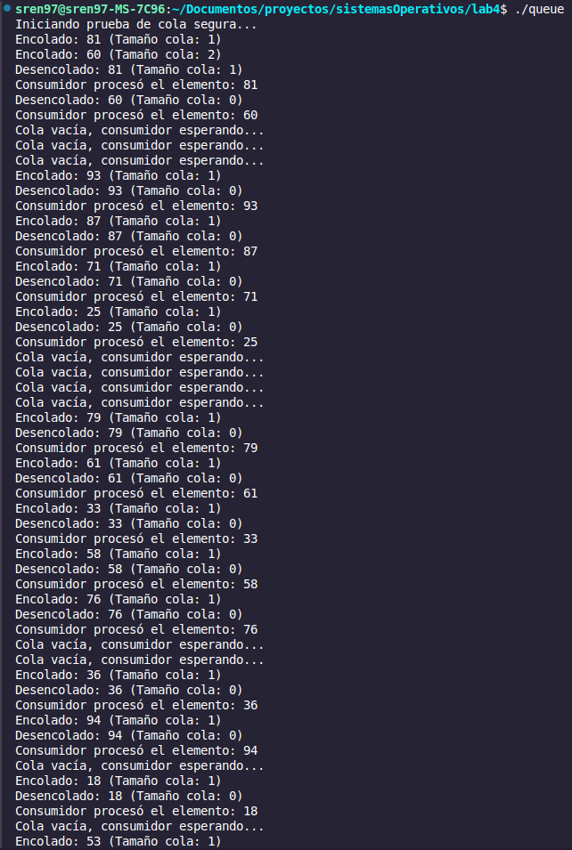
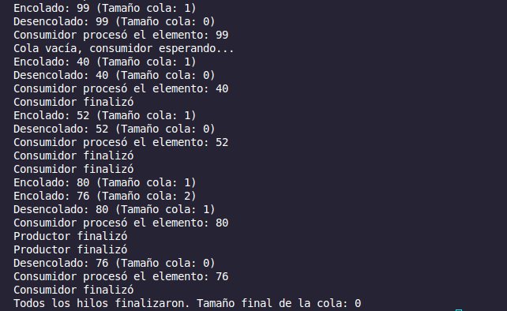
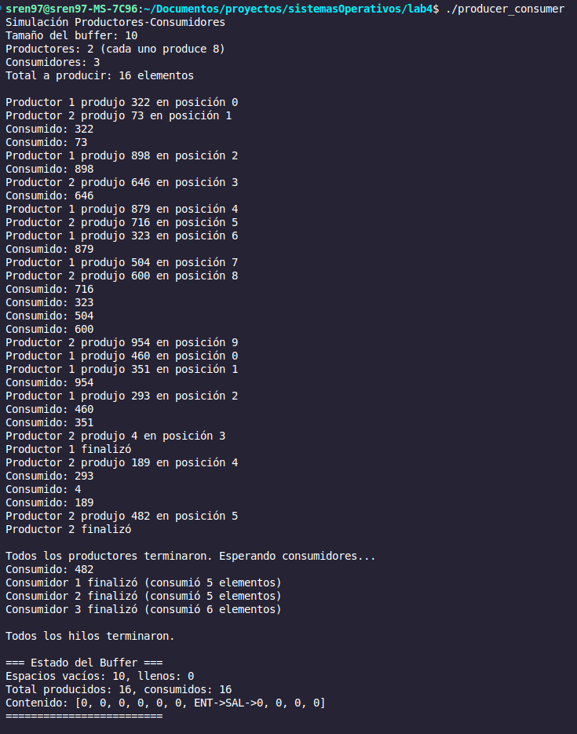
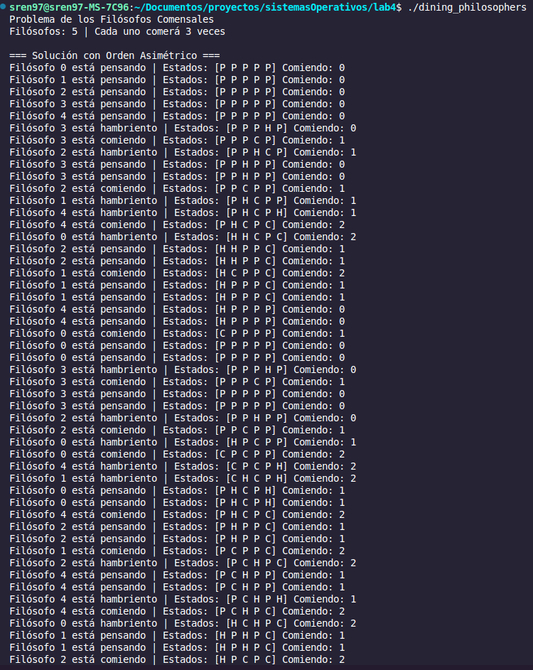
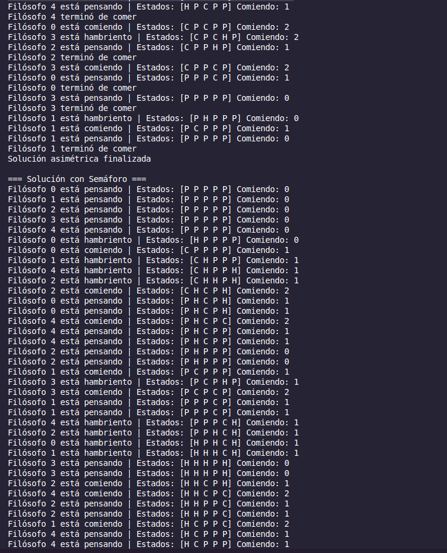
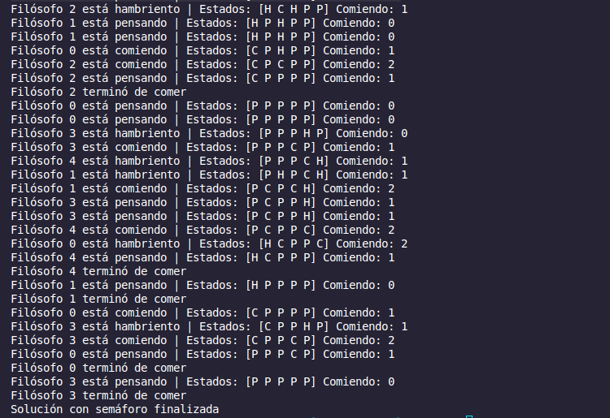

# Practice 4- Synchronization Mechanisms in Operating Systems
Sebastián Rentería Palacios
David Agudelo Ochoa

## Descripción General

Este proyecto aborda tres problemas fundamentales de sincronización en sistemas operativos, cada uno implementado con distintos mecanismos de coordinación entre hilos. 

La primera implementación consiste en una Cola Thread-Safe que utiliza mutexes y variables de condición para gestionar el acceso concurrente, permitiendo a múltiples hilos realizar operaciones.

El segundo desarrollo resuelve el problema clásico del Productor-Consumidor mediante semáforos, controlando el acceso a un buffer compartido de tamaño limitado. 

Finalmente, se aborda el Problema de los Filósofos Cenando con dos soluciones diferentes que previenen el deadlock, demostrando cómo diferentes estrategias pueden resolver un mismo problema de concurrencia.

## Implementaciones y Mecanismos

La Cola Thread-Safe emplea sincronización basada en estado mediante variables de condición, lo que permite a los hilos esperar eficientemente hasta que puedan realizar sus operaciones, evitando la espera activa. 

En el caso del Productor-Consumidor, los semáforos funcionan como contadores para regular el acceso al buffer compartido, señalizando cuándo hay espacio disponible para producir y cuándo hay elementos para consumir. 

El problema de los Filósofos Cenando se resuelve tanto mediante una estrategia asimétrica que rompe la dependencia circular como a través de una solución que limita el número máximo de filósofos que pueden intentar comer simultáneamente, ambas enfocadas en prevenir las condiciones que llevarían a un deadlock.

## Prerrequisitos y Compilación

Para la ejecución de este proyecto se requiere un compilador GCC con soporte para pthreads, un entorno Linux/Unix (o WSL) y soporte para semáforos POSIX. La compilación se realiza mediante los siguientes comandos:

```bash
g++ -o queue queue.cpp -pthread
g++ -o producer_consumer producer_consumer.cpp -pthread
g++ -o dining_philosophers dining_philosophers.cpp -pthread
```

## Ejecución y Resultados

ejecutar individualmente (c++)
`./queue`
`./producer_consumer`
`./dining_philosophers`

ejecutar individualmente (go)
`go run queue.go`
`go run producer_consumer.go`
`go run dining_philosophers.go`

A continuación se muestran los resultados de cada ejecución en c++, evidenciando el correcto funcionamiento de los mecanismos de sincronización implementados.

### Cola Thread-Safe



La ejecución de la cola thread-safe demuestra cómo las variables de condición optimizan la sincronización de los estados, permitiendo a los hilos bloquearse y despertarse según la disponibilidad de espacio o elementos en la cola.

### Productor-Consumidor


El resultado del programa productor-consumidor ilustra cómo los semáforos coordinan la producción y consumo de elementos en un buffer, implementado el manejo de la terminación cuando los productores han completado su trabajo.

### Filósofos Comensales




La ejecución del problema de los filósofos comensales muestra cómo ambas soluciones implementadas evitan el deadlock, permitiendo a todos los filósofos alternar entre pensar y comer sin que ninguno quede permanentemente bloqueado.
